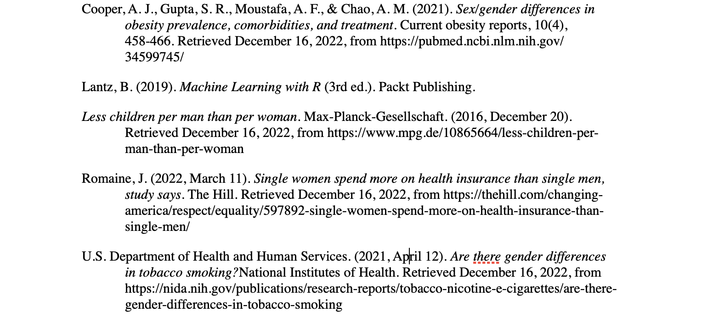

---

# Final Project

As the final project of this class, you will either 

1) analyze a data set using some of the methods for causal inference that we discuss or 

The findings will be written-up in a short paper not to exceed six pages including reference.

# Data
The data applied here is obtained from the book Machine Learning with R by Brett Lantz. Since the US Census Bureau's demographic figures were used to compile the data originally, it roughly reflects actual situations. It contains 1,338 samples of beneficiaries who are presently enrolled in the insurance plan, with attributes that describe the patient's features and the total amount of medical costs billed to the plan for the calendar year. The features are:

- `age`: An integer indicating the age of the primary beneficiary (excluding those above 64 years, as they are generally covered by the government). 

- `sex` (treatment, Z): The policy holder's gender: either male or female. 

- `bmi`: The body mass index (BMI), which provides a sense of how over
or underweight a person is relative to their height. BMI is equal to weight (in kilograms) divided by height (in meters) squared. An ideal BMI is within the range of 18.5 to 24.9.

- `children`: An integer indicating the number of children/dependents covered by the insurance plan. 

- `smoker`: A yes or no categorical variable that indicates whether the insured regularly smokes tobacco.

- `region`: The beneficiary's place of residence in the US, divided into four geographic regions: northeast (4), southeast (2), southwest (1), or northwest (3). 

- `charges` (outcome, Y): medical cost per year in dollars.

```{r, message=FALSE}
library(tibble)
library(tidyverse)
library(MatchIt)
library(modelsummary)
library(dagitty)
library(ggdag)
library(ggplot2)

data <- read.csv("insurance.csv") %>% mutate(sex = ifelse(sex == "female", 1, 0),
                                             smoker = ifelse(smoker == "yes", 1, 0),
                                             region = ifelse(region == "southwest", 1,
                                                             ifelse(region == "southeast", 2,
                                                                    ifelse(region == "northwest", 3, 4))))
head(data)
```

# Directed Acyclic Graph (DAG)
```{r}
dag <- dagify(bill ~ bmi + kid + smoke + region + age + sex,
              sex ~ bmi + kid + smoke + region + age)
ggdag(dag, edge_type = "link") + theme_dag()
```

I first focus on the outcome which is the insurance bill, I think all observed features have influence on that. Age, whether is a smoker, bmi and number of children covered belong to the personal physical information that affects the insurance price. Region is important too because different regions have different tax rates. Then, I look at the treatment gender. female tend to have more kids covered (Less children per man than per woman 2016), relatively higher bmi (ooper & Gupta, Moustafa & Chao, 2021) and be less likely a smoker (Are there gender differences in tobacco smoking? 2021). What’s more, young single women may pay the health insurance early than men (Romaine, 2022), therefore the age is also related to gender. To sum up, all observed variable except bill and sex are confounders.


\newpage
# Assumptions

1. Causal Ordering

It is obvious to see that the cost of health insurance can’t affect individuals’ gender so the causal ordering assumption is followed.

2. Stable Unit-treatment Variation Assumption (SUTVA)

Because each unit represents one individual so there’s no interference between each unit. As for the treatment gender, the data recorded natural biological gender which only contains male and female, thus there’s no hidden version of treatment.

3. Overlap Assumption

I did this via propensity score. Look at the propensity score distributions in both groups, it shows that both groups are overlapped but with three outliers. Since there is only a few of it, I don’t remove them.
```{r}
#Compute Propensity Score
model <- glm(sex ~ age + bmi + children + smoker + region, data = data,
             family = binomial(link = "logit"))
data$propensity_score <- predict(model, data, type = "response")

# Propensity Score Distribution Plot
data %>% ggplot() + geom_boxplot(mapping = aes(x=propensity_score, group = sex, color = sex))

#Outliers
range_e <- data %>% group_by(sex) %>% summarise(min = min(propensity_score),
                                                max = max(propensity_score))

outliers <- rbind(data %>% filter(sex == 0, !between(propensity_score, range_e[2,2], range_e[2,3])),
                  data %>% filter(sex == 1, !between(propensity_score, range_e[1,2], range_e[1,3]))
                  )
nrow(outliers)
```

4. Unconfoundness Assumption

The treatment assignment of gender conditioned on covariates does not depend on any potential outcomes which means that the gender factor is independent of the health insurance charges that female or male individual would need to pay. Therefore, this assumption is fulfilled.

# Various Estimators via Different Methods and Summary of Estimation Results

1. Check Balance

I am really happy with these balances since the data has similar sample size for each group (male has 14 more data) and similar means for every pre-treatment characteristics floating within approximately 0.05.
```{r}
balance <- data %>%
  group_by(sex) %>%
  summarise(sample_size = n(),
            proportion = n()/nrow(data),
            ave_age = mean(age),
            ave_bmi = mean(bmi),
            ave_children = mean(children),
            ave_smoker = mean(smoker),
            ave_region = mean(region),
            ave_charges = mean(charges))
balance
diff(balance$ave_charges) #female pay more, male pay less
```

2. Get Various Estimators via Different Methods
```{r, message=FALSE}
#1 Naive difference in means
naive <- lm(charges ~ sex, data = data)

#2 Adjustment with Mahalanobis nearest-neighbor matching
adjusted <- matchit(sex ~ age + bmi + children + smoker + region, data = data)
Mnnmatching <- lm(charges ~ sex, data = match.data(adjusted), weights = weights)

#3 Adjustment with inverse probability weighting
block <- quantile(data$propensity_score, probs = seq(0, 1, 0.1))
data$block <- cut(data$propensity_score, breaks = block, labels = 1:10, include.lowest=TRUE)
data$ipw <- (data$sex/data$propensity_score)+((1-data$sex)/(1-data$propensity_score))
weighting <- lm(charges ~ sex, data = data, weights = ipw)

#4 regression adjustment (ANCOVA) using all the confounders
rgs_allCon <- lm(charges ~ sex + age + bmi + children + smoker + region, data = data)

#5 regression adjustment using the estimated propensity score and the treatment status as the predictors, but no other confounders
rgs_psTreatment <- lm(charges ~ sex + propensity_score, data = data)

#6 regression adjustment using the estimated propensity score, in addition to the treatment status and all confounders as the covariates.
rgs_psAll <- lm(charges ~ sex + propensity_score + age + bmi + children + smoker + region, data = data)

#7 Weighted average treatment effect estimator using the overlap weight
data$overlap_weight <- data$sex * (1-data$propensity_score) + (1-data$sex) * data$propensity_score
overlapW <- lm(charges ~ sex + age + bmi + children + smoker + region, data = data, weights = overlap_weight)

#8 Regression on clever covariate (inverse probability as an additional covariate)
rgs_ipwAll <- lm(charges ~ sex + ipw + age + bmi + children + smoker + region, data = data)

#9 Weighted Regression (inverse probability as the weights)
Wrgs <- lm(charges ~ sex + age + bmi + children + smoker + region, data = data, weights = ipw)

# Compare Various Estimators
modelsummary(list("Naive" = naive,
                  "Matching" = Mnnmatching,
                  "Weighting(W.)" = weighting), 
             estimate = "est:{estimate}",
             statistic = NULL,
             coef_omit = 1)

modelsummary(list("Overlap W."=overlapW,
                  "Inverse Probability W.: all+ipw" = rgs_ipwAll,
                  "W. Regression"=Wrgs,
                  "ANCOVA(A.): all" = rgs_allCon,
                  "A.: all+ps" = rgs_psAll,
                  "A.: ps+sex" = rgs_psTreatment), 
             estimate = "est:{estimate}",
             statistic = NULL,
             coef_omit = c(1,3:9))


#10 stratification using propensity score
stratification <- data %>%
  group_by(block, sex) %>%
  summarise(mean = mean(charges),
            count = n()) %>%
  group_by(block) %>%
  summarise(meandiff = diff(mean),
            count = sum(count)) %>%
  mutate(ATE = meandiff*(count/nrow(data)))
   #ATE
sum(stratification$ATE)
```

Based on $R^2$ and $R_{adj}^2$, I think "overlap weighting" model, "weighting regression" model, "ANCOVA: all" model, and "ANCOVA: all+ps" model is not that fit for the data comparing with other models. So I pay more atttention on other methods. Except "ANCOVA: all+ps" model's estimator and the estimator by "stratification using propensity score" are more than `$200` per year, all other estimator have a common range from approximately `$122` to `$131` per year. Since they all show a positive result, it can be concluded that the overall effects on the insurance bill is that female pay more than male per year.


# Reference

